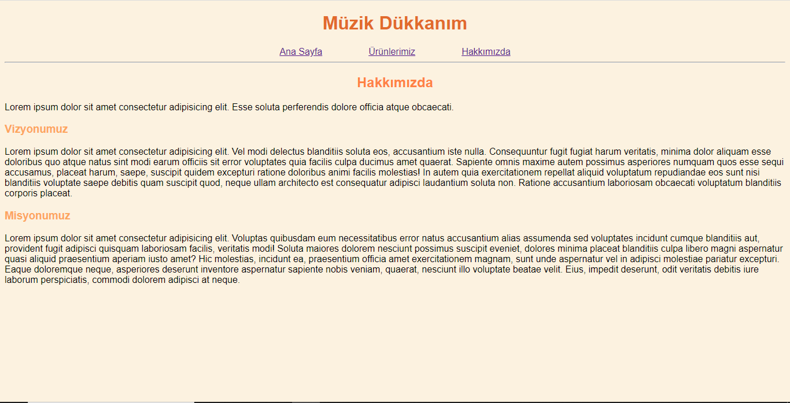

# Music Shop Web Page

This is an assignment named "Müzik Dükkanım" as part of the [CSS](https://app.atika.dev/courses/css) and [Bootstrap](https://app.patika.dev/courses/bootstrap) courses at [Patika](https://app.atika.dev).

- It consists of three web pages.
- In the first version, the website were created with only HTML and CSS. In second version, Bootstrap were added.
- There are some differences in the interface of the website between the first version and the second version.

## Interface without the Bootstrap

## Interface with the Bootstrap

- [The First Version Assignment Link](https://app.patika.dev/courses/css/odev1)
- [The Second Version Assignment Link](https://app.patika.dev/courses/bootstrap/odev1)
